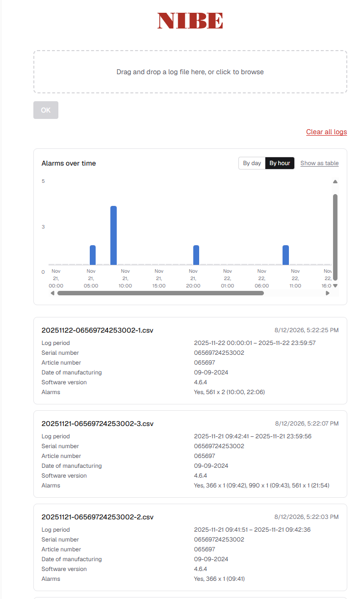

This is a [Next.js](https://nextjs.org) project bootstrapped with [`create-next-app`](https://nextjs.org/docs/app/api-reference/cli/create-next-app).

## Getting Started

Run the development server:

```bash
npm run dev
```

Open [http://localhost:3000](http://localhost:3000) with your browser to see the result.

This project uses [`next/font`](https://nextjs.org/docs/app/building-your-application/optimizing/fonts) to automatically optimize and load [Geist](https://vercel.com/font), a new font family for Vercel.


## Application description

This project is a web application, dedicated to NIBE service providers. It helps to analyse NIBE heat pump logs by extracting and summarising information from logs: heat pump model, manufacturing date, alarms, etc. Service worker uploads logs to the appliation and appliation shows extracted information in charts and readable text format. Main purpose of application to make Nibe maintenance service quicker and more reliable.

Screenshot of application: 
